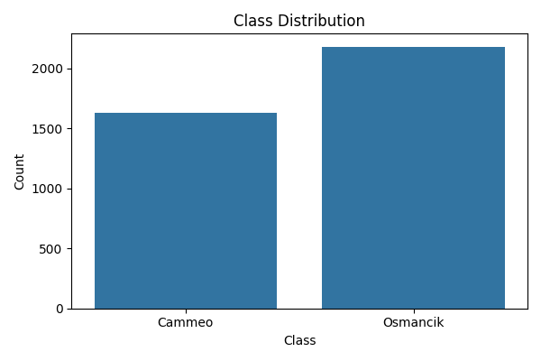
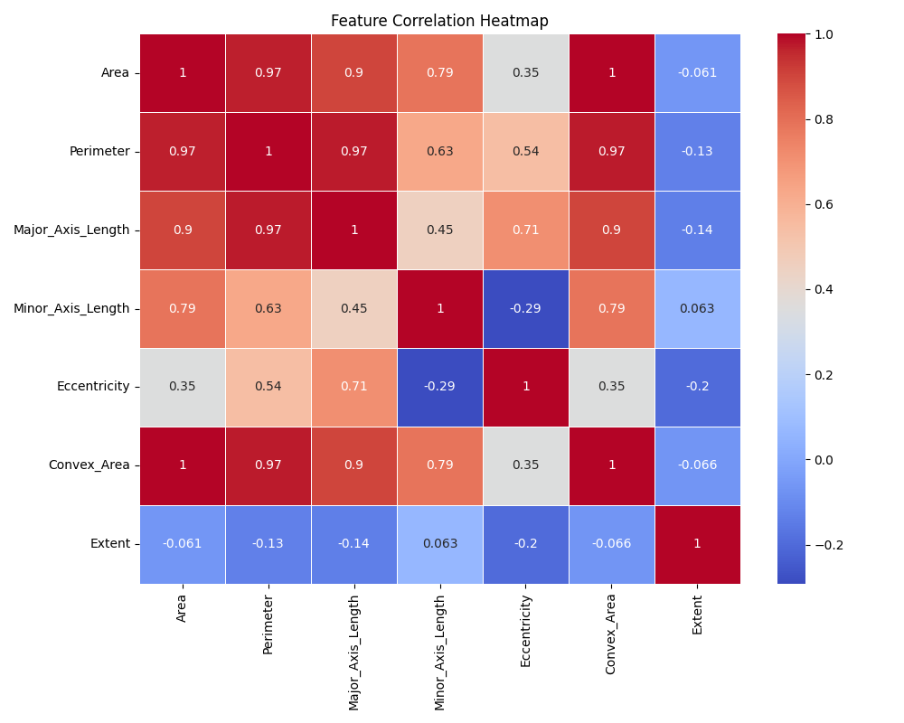
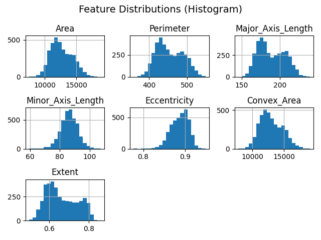
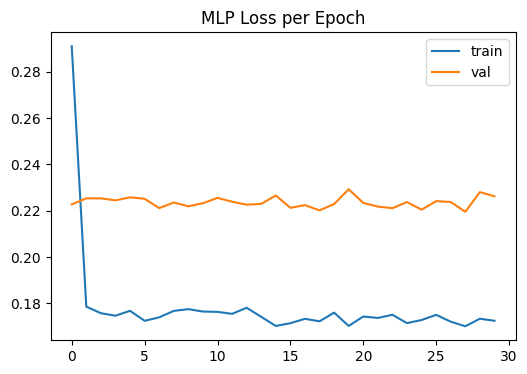
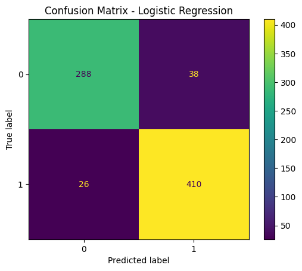
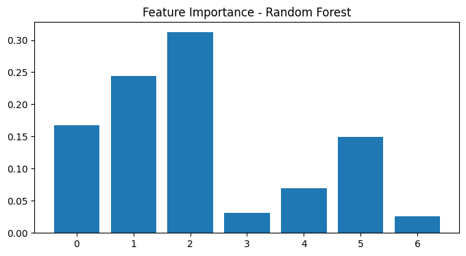
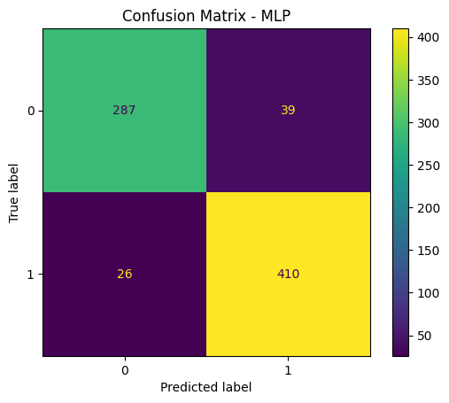
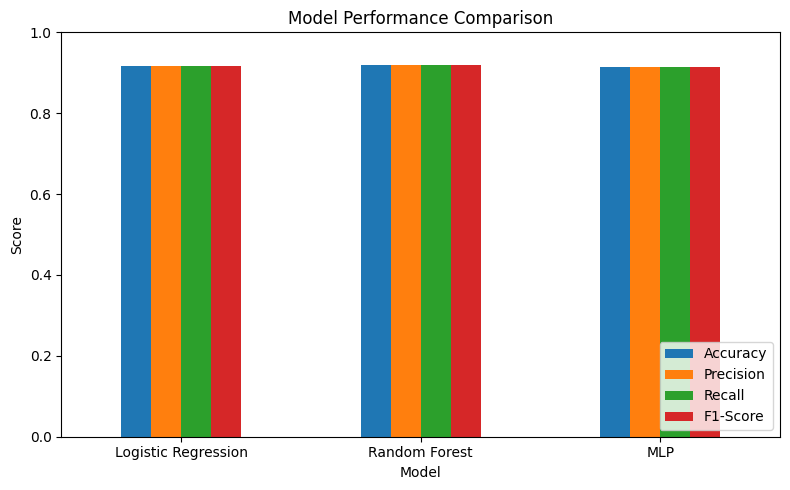
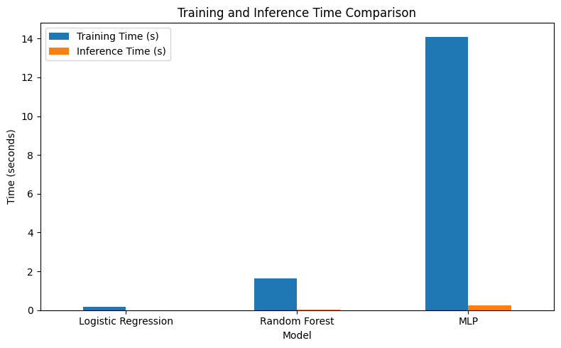

## INFORMASI PROYEK

**Judul Proyek:**  
Perbandingan Model Machine Learning dan Deep Learning dalam Klasifikasi Varietas Beras Cammeo dan Osmancik

**Nama Mahasiswa:** Hanifah Alya Nuraini  
**NIM:** 233307015  
**Program Studi:** Teknologi Informasi
**Mata Kuliah:** Data Science  
**Dosen Pengampu:** Gus Nanang Syaifuddiin, S.Kom., M.Kom.  
**Tahun Akademik:** 2025 / 5

**Link GitHub Repository:** (https://github.com/selena2355/Data-Science.git)

**Link Video Pembahasan:** [URL Repository]

---

## 1. LEARNING OUTCOMES

Pada proyek ini, mahasiswa diharapkan dapat:
1. Memahami konteks masalah dan merumuskan problem statement secara jelas
2. Melakukan analisis dan eksplorasi data (EDA) secara komprehensif (**OPSIONAL**)
3. Melakukan data preparation yang sesuai dengan karakteristik dataset
4. Mengembangkan tiga model machine learning yang terdiri dari (**WAJIB**):
   - Model baseline
   - Model machine learning / advanced
   - Model deep learning (**WAJIB**)
5. Menggunakan metrik evaluasi yang relevan dengan jenis tugas ML
6. Melaporkan hasil eksperimen secara ilmiah dan sistematis
7. Mengunggah seluruh kode proyek ke GitHub (**WAJIB**)
8. Menerapkan prinsip software engineering dalam pengembangan proyek

---

## 2. PROJECT OVERVIEW

### 2.1 Latar Belakang
Pertanian merupakan sektor penting dalam mendukung ketahanan pangan global, dan beras merupakan salah satu komoditas pangan utama dunia. Identifikasi varietas beras secara akurat menjadi krusial karena variasi varietas memengaruhi kualitas, harga, dan penggunaan produk akhir. Namun, identifikasi varietas secara manual memerlukan waktu dan tenaga serta rentan terhadap kesalahan manusia.

Dalam beberapa tahun terakhir, teknik pembelajaran mesin (machine learning) dan pembelajaran mendalam (deep learning) telah digunakan untuk mengotomatisasi klasifikasi varietas tanaman, termasuk beras, dengan hasil yang menunjukkan peningkatan akurasi dan efisiensi. Penelitian *RiceSeedNet: Rice seed variety identification using deep neural network* memperlihatkan bahwa model neural network dapat mencapai akurasi tinggi dalam identifikasi varietas benih beras melalui ekstraksi fitur visual secara otomatis, memberikan alternatif yang lebih cepat dibandingkan metode manual.

Selain itu, studi *Rice Varieties Classification Using Machine Learning Algorithms* menunjukkan bahwa algoritma Machine Learning seperti Logistic Regression, Random Forest, dan model lainnya dapat digunakan untuk mengklasifikasi beberapa varietas padi dengan performa yang menjanjikan, menegaskan potensi penggunaan teknik data-driven dalam domain pertanian.

Dataset Rice (Cammeo and Osmancik) dari *UCI Machine Learning Repository* menyediakan data fitur morfologi biji beras yang dapat dimanfaatkan untuk eksperimen klasifikasi varietas. Dataset ini mencakup tujuh fitur kontinu yang diekstraksi dari citra biji beras, sehingga cocok untuk dianalisis dengan metode machine learning dan deep learning.

Dengan mengaplikasikan dan membandingkan beberapa model Machine Learning dan Deep Learning pada dataset ini, penelitian ini diharapkan dapat memberikan pemahaman mengenai efektivitas masing-masing pendekatan dalam tugas klasifikasi varietas beras.

**Referensi Ilmiah:**
> Ratnavel R., Sahil F., Sivasankaran S., Geetha R. (2024). *RiceSeedNet: Rice seed variety identification using deep neural network*. *Journal of Agriculture and Food Research*, 16, 101062.

> Pranshu S., Kanu P., Sachin G., Puneet Kumar A., Amit S., Parita J. (2022).*Rice Varieties Classification Using Machine Learning Algorithms*. Journal of Pharmaceutical Negative Results, Special Issue, 3762–3772.

## 3. BUSINESS UNDERSTANDING / PROBLEM UNDERSTANDING

### 3.1 Problem Statements
1. Proses identifikasi varietas beras Cammeo dan Osmancik secara manual sulit dilakukan secara konsisten karena kemiripan karakteristik fisik antar varietas.
2. Dataset beras memiliki banyak fitur numerik hasil ekstraksi citra yang sulit dianalisis tanpa pendekatan berbasis machine learning.
3. Diperlukan model klasifikasi yang mampu mempelajari pola non-linear antar fitur untuk meningkatkan akurasi identifikasi varietas beras.
4. Dibutuhkan perbandingan antara model Machine Learning dan Deep Learning untuk menentukan pendekatan yang paling efektif dalam mengklasifikasikan varietas beras.

### 3.2 Goals
1. Membangun model klasifikasi untuk membedakan varietas beras Cammeo dan Osmancik menggunakan data fitur morfologi dengan tingkat akurasi yang baik.
2. Mengimplementasikan dan membandingkan tiga pendekatan pemodelan, yaitu model baseline (Logistic Regression), model Machine Learning lanjutan (Random Forest), dan model Deep Learning (Multilayer Perceptron).
3. Mengevaluasi performa masing-masing model menggunakan metrik evaluasi yang sesuai untuk klasifikasi, seperti Accuracy dan F1-Score.

### 3.3 Solution Approach
Untuk menyelesaikan permasalahan klasifikasi varietas beras Cammeo dan Osmancik, proyek ini menggunakan tiga pendekatan pemodelan yang terdiri dari model baseline, model machine learning lanjutan, dan model deep learning. Pendekatan ini bertujuan untuk membandingkan performa model sederhana hingga kompleks dalam mempelajari pola pada data tabular.

#### **Model 1 – Baseline Model (Logistic Regression)**
Model baseline yang digunakan pada penelitian ini adalah Logistic Regression. Logistic Regression merupakan algortima klasifikasi linear yang bekerja dengan memodelkan hubungan antara fitur input dan probabilitas kelas target menggunakan fungsi logistik.

Alasan pemilihan model:
- Sederhana dan mudah diimplementasikan
- Sering digunakan sebagai baseline pada permasalahan klasifikasi biner
- Memberikan gambaran awal performa sebelum menggunakan model yang lebih kompleks
- Efisien dalam waktu pelatihan dan interpretatif
model ini digunakan sebagai pembanding dasar untuk mengevaluasi peningkatan performa yang diperoleh dari model yang lebih kompleks.

#### **Model 2 – Advanced / ML Model (Random Forest)**
Model machine learning lanjutan yang digunakan adalah Random Forest. Random Forest merupakan algoritma ensemble berbasis Decision Tree yang menggabungkan banyak pohon keputusan untuk meningkatkan akurasi dan mengurangi overfitting.

Alasan pemilihan model:
- Mampu menangkap hubungan non-linear antar fitur
- Lebih robust terhadap noise dibandingkan model linear
- Cocok untuk data tabular dengan banyak fitur numerik
- Umum digunakan pada tugas klasifikasi di domain pertanian dan citra hasil ekstraksi fitur
Random Forest diharapkan mampu memberikan performa yang lebih baik dibandingkan model baseline karena kemampuannya dalam mempelajari pola yang lebih kompleks.

#### **Model 3 – Deep Learning Model (Multilayer Perceptron)**
Untuk memenuhi kebutuhan penggunaan deep learning, model yang dipilih adalah Multilayer Perceptron (MLP). MLP merupakan arsitektur neural nerwork yang sesuai untuk data tabular dan mampu mempelajari hubungan non-linear yang kompleks antar fitur.

Alasan pemilihan model:
- Dataset berupa data tabular numerik hasil ekstraksi fitur citra
- MLP cocok untuk klasifikasi biner pada data non-sekuensial
- Memiliki kemampuan representasi fitur yang lebih kuat dibandingkan model machine learning konvensional

Model MLP yang digunakan terdiri dari:
- Input layer sesuai jumlah fitur
- Dua hidden layer dengan aktivasi ReLU
- Dropout layer untuk mengurangi overfitting
- Output layer dengan aktivasi sigmoid untuk klasifikasi biner
Model deep learning ini dilatih selama 30 epoch dan dievaluasi menggunakan data uji. selain itu, dilakukan visualisasi training berupa grafik loss dan accuracy untuk menganalisis proses pembelajaran model.

---

## 4. DATA UNDERSTANDING

### 4.1 Informasi Dataset
**Sumber Dataset:**  
UCI ML Repository: (https://archive.ics.uci.edu/dataset/545/rice+cammeo+and+osmancik)

**Deskripsi Dataset:**
- Jumlah baris (rows): 3.810 data
- Jumlah kolom (columns/features): 8 kolom (7 fitur numerik + 1 label kelas)
- Tipe data: Tabular
- Ukuran dataset: ± 0.5 MB
- Format file: ARFF

### 4.2 Deskripsi Fitur
Dataset Rice (Cammeo and Osmancik) terdiri dari fitur-fitur numerik hasil ekstraksi citra butir beras serta satu label kelas. Berikut adalah deskripsi setiap fitur:

| Nama Fitur        | Tipe Data   | Deskripsi                                                    | Contoh Nilai     |
| ----------------- | ----------- | ------------------------------------------------------------ | ---------------- |
| Area              | Float       | Luas area butir beras hasil segmentasi citra                 | 7555.0, 13211.5  |
| Perimeter         | Float       | Panjang keliling (boundary) butir beras                      | 339.1, 442.7     |
| Major_Axis_Length | Float       | Panjang sumbu utama elips yang memodelkan bentuk butir beras | 95.2, 140.6      |
| Minor_Axis_Length | Float       | Panjang sumbu minor elips yang memodelkan bentuk butir beras | 55.3, 98.4       |
| Eccentricity      | Float       | Tingkat kelonjongan bentuk elips (0–1)                       | 0.68, 0.95       |
| Convex_Area       | Float       | Luas area convex hull dari butir beras                       | 7600.0, 13400.2  |
| Extent            | Float       | Rasio antara area objek dengan bounding box                  | 0.62, 0.85       |
| Class             | Categorical | Label varietas beras (target klasifikasi)                    | Cammeo, Osmancik |

### 4.3 Kondisi Data
Berdasarkan hasil eksplorasi awal terhadap dataset Rice (Cammeo and Osmancik), diperoleh kondisi data sebagai berikut:

- **Missing Values:** 
Tidak ditemukan missing values pada seluruh fitur dalam dataset. Dataset sudah dalam kondisi lengkap sehingga tidak diperlukan imputasi data.
- **Duplicate Data:** 
Tidak ditemukan data duplikat berdasarkan pemeriksaan baris data secara keseluruhan. Setiap sampel merepresentasikan satu butir beras yang unik
- **Outliers:** 
Tidak dilakukan analisis outlier secara khusus. Berdasarkan histogram, variasi nilai fitur masih mencerminkan karakteristik alami data sehingga seluruh data tetap digunakan.
- **Imbalanced Data:**
Dataset memiliki distribusi kelas yang sedikit tidak seimbang, dengan jumlah data Osmancik sebanyak 2.180 sampel dan Cammeo sebanyak 1.630 sampel. Perbedaan ini masih dalam batas wajar dan tidak dilakukan teknik data balancing khusus.
- **Noise:** 
Tidak teridentifikasi noise yang signifikan karena fitur berasal dari hasil ekstraksi citra terkontrol dan bersifat numerik kontinu.
- **Data Quality Issues:** 
Secara umum, kualitas data tergolong baik. Dataset telah melalui proses ekstraksi fitur sebelumnya sehingga siap digunakan untuk tahap pemodelan tanpa preprocessing kompleks tambahan.

### 4.4 Exploratory Data Analysis (EDA) - (**OPSIONAL**)
#### Visualisasi 1: Class Distribution


**Insight:**  
Plot distribusi kelas menunjukkan bahwa dataset terdiri dari dua kelas, yaitu Cammeo (1630) dan Osmancik (2180). Distribusi ini tidak sepenuhnya seimbang, namun perbedaannya masih dalam batas moderat dan tidak menunjukkan ketimpangan ekstrem. Kondisi ini memungkinkan model tetap dilatih tanpa teknik data balancing tambahan, terutama jika metrik evaluasi yang digunakan tidak hanya bergantung pada accuracy, tetapi juga precision, recall, dan F1-score

#### Visualisasi 2: Feature Correlation Heatmap



**Insight:**  
Heatmap korelasi memperlihatkan adanya korelasi yang sangat kuat antar fitur berbasis ukuran, seperti *Area*, *Perimeter*, *Major Axis Lenght*, dan *Covex Area* (nilai korelasi > 0.9). Hal ini mengindikasikan bahwa fitur-fitur tersebut membawa informasi yang mirip dan berpotensi menyebabkan multikolinearitas, terutama pada model linear. Sabaliknya, fitur *Extent* dan *Eccentricity* memiliki korelasi yang relatif rendah terhadap fitur lain, sehingga berpotensi memberikan informasi tambahan yang lebih independen bagi model.

#### Visualisasi 3: Feature Distribution (Histogram)



**Insight:**  
Histogram menunjukkan distribusi nilai setiap fitur numerik seperti *Area*, *Perimeter*, *Major/Minor Axis Lenght*, *Eccentricity*,* Covex Area*, dan *Extent*. Sebagian besar fitur memiliki distribusi mendekati normal, meskipun beberapa terlihat sedikit skewed, terutama pada fitur ukuran seperti *Area* dan *Perimeter*. Hal ini wajar karena ukuran fisik objek biologis jarang benar-benar simetris distribusinya. Tidak terlihat lonjakan ekstrem yang mengindikasikan outlier parah, sehingga data masih tergolong stabil untuk langsung digunakan setelah normalisasi atau scaling.

---

## 5. DATA PREPARATION

### 5.1 Data Cleaning
**Aktivitas:**
- Data type conversion

```
Data Type Conversion:
- Seluruh fitur numerik awalnya bertipe `float64`.
- Kelas awalnya bertipe `int64`
- Fitur dan kelas kemudian dikonversi menjadi `float32` untuk meningkatkan efisiensi memori dan kompatibilitas dengan model deep learning.
- Konversi ini tidak mengubah nilai data secara signifikan namun mempercepat proses komputasi.
```

### 5.2 Feature Engineering
**Aktivitas:** - 

Pada penelitian ini, tidak dilakukan pembuatan fitur baru (creating new features) secara eksplisit. Dataset yang digunakan telah menyediakan fitur-fitur numerik hasil ekstraksi citra (image-based features) yang secara langsung merepresentasikan karakteristik morfologi butir beras, seperti luas, keliling, dan panjang sumbu.

Feature extraction tidak dilakukan kembali karena seluruh fitur yang digunakan merupakan hasil ekstraksi sebelumnya dari citra beras menggunakan teknik pengolahan citra. Oleh karena itu, penelitian ini berfokus pada pemanfaatan fitur yang telah tersedia.

Feature selection tidak dilakukan secara eksplisit, namun analisis korelasi antar fitur digunakan untuk memahami hubungan dan potensi redundansi antar fitur. Seluruh fitur tetap dipertahankan karena model yang digunakan (Random Forest dan MLP) memiliki kemampuan untuk menangani fitur yang berkorelasi.

Dimensionality reduction seperti PCA tidak diterapkan karena jumlah fitur relatif kecil dan masih dapat ditangani secara efisien oleh model. Selain itu, pengurangan dimensi berpotensi menghilangkan interpretabilitas fitur fisik yang penting dalam konteks klasifikasi varietas beras.


### 5.3 Data Transformation
Proses data transformation dilakukan untuk memastikan data berada dalam format yang sesuai dan optimal bagi proses pemodelan machine learning dan deep learning.

**Encoding**

Target label pada dataset dikodekan menggunakan Label Encoding. Setiap kelas varietas beras direpresentasikan sebagai nilai numerik agar dapat diproses oleh algoritma klasifikasi.
```
Encoding yang digunakan:
- Label Encoding pada variabel target
- Kelas "Cammeo" -> 0
- Kelas "Osmancik" -> 1
```
Alasan Pemilihan:
- Label bersifat kategorikal tanpa urutan (binary classification)
- Logistic Regression, Random Forest, dan MLP membutuhkan input target numerik
- One-Hot Encoding tidak diperlukan karena hanya terdapat 2 kelas

**Scaling**

Seluruh fitur numerik dilakukan standardisasi menggunakan StandardScaler, dengan rumus:
```
z = x − μ​ / σ
```
di mana:
- μ​ adalah mean fitur
- σ adalah standar deviasi fitur

Alasan Pemilihan:
- Dataset memiliki fitur dengan skala berbeda-beda
- Logistic Regression dan MLP sensitif terhadap skala fitur
- StandardScaler membantu mempercepat konvergensi model dan meningkatkan stabilitas training

### 5.4 Data Splitting

**Strategi pembagian data:**
```
- Training set: 80% (3.048 samples)
- Test set: 20% (762 samples)
- Validation set: Tidak dibuat terpisah
```

Pembagian data dilakukan menggunakan metode train-test split dengan rasio 80:20.  
Untuk menjaga proporsi kelas target tetap konsisten antara data latih dan data uji, digunakan teknik stratified split berdasarkan label kelas.

Strategi ini memastikan bahwa distribusi kelas Cammeo dan Osmancik pada data training dan testing tetap seimbang, sehingga hasil evaluasi model menjadi lebih representatif.

Parameter `random_state=42` digunakan untuk menjamin reproducibility, sehingga hasil pembagian data dapat direproduksi kembali pada eksperimen selanjutnya.

Pada model deep learning, data validasi diperoleh dari data training menggunakan parameter `validation_split=0.2` saat proses training, sehingga tidak diperlukan pemisahan validation set secara eksplisit.

### 5.5 Data Balancing
Berdasarkan hasil analisis distribusi kelas, dataset memiliki dua kelas dengan jumlah data sebagai berikut:
- Kelas Osmancik: 2.180 sampel
- Kelas Cammeo: 1.630 sampel

Distribusi ini menunjukkan adanya **ketidakseimbangan kelas ringan (mild imbalance)** dengan rasio sekitar 57:43. Ketidakseimbangan tersebut masih dalam batas wajar dan tidak tergolong sebagai *severe imbalance*.

Oleh karena itu, tidak dilakukan teknik data balancing seperti SMOTE, undersampling, maupun class weighting. Keputusan ini diambil dengan pertimbangan bahwa:
1. Rasio kelas masih relatif seimbang
2. Teknik stratified split sudah digunakan saat pembagian data
3. Model yang digunakan (Random Forest dan MLP) cukup robust terhadap ketidakseimbangan ringan
4. Data balancing berpotensi mengubah distribusi asli data dan menimbulkan bias baru

Sebagai gantinya, evaluasi model dilakukan menggunakan beberapa metrik klasifikasi (accuracy, precision, recall, dan F1-score) untuk memastikan performa model tetap adil pada kedua kelas.

### 5.6 Ringkasan Data Preparation

1. **Data Cleaning**  
   - **Apa:** Pemeriksaan missing values, duplikasi data, dan konversi tipe data numerik dari `float64` ke `float32`.  
   - **Mengapa:**  
     - Missing values dan duplikasi dapat menurunkan kualitas data  
     - Konversi tipe data diperlukan untuk efisiensi memori dan kompatibilitas dengan model deep learning  
   - **Bagaimana:**  
     - Missing values dan duplikasi diperiksa menggunakan fungsi pandas  
     - Konversi tipe data dilakukan menggunakan `.astype('float32')` pada fitur numerik

2. **Feature Engineering**  
   - **Apa:** Tidak dilakukan pembuatan fitur baru  
   - **Mengapa:**  
     - Dataset sudah memiliki fitur numerik yang representatif dan relevan  
     - Penambahan fitur berpotensi menambah noise tanpa meningkatkan performa model  
   - **Bagaimana:**  
     - Seluruh fitur asli dipertahankan dan digunakan langsung dalam pemodelan

3. **Data Transformation**  
   - **Apa:** Encoding label dan scaling fitur numerik  
   - **Mengapa:**  
     - Model machine learning dan deep learning membutuhkan input numerik  
     - Scaling diperlukan agar setiap fitur memiliki skala yang sebanding  
   - **Bagaimana:**  
     - Label kelas diubah menjadi nilai numerik menggunakan `LabelEncoder`  
     - Fitur dinormalisasi menggunakan `StandardScaler` (mean = 0, std = 1)

4. **Data Splitting**  
   - **Apa:** Pembagian dataset menjadi training set dan test set  
   - **Mengapa:**  
     - Untuk menguji kemampuan generalisasi model pada data yang belum pernah dilihat  
   - **Bagaimana:**  
     - Menggunakan `train_test_split` dengan rasio 80:20  
     - Stratified split diterapkan untuk menjaga proporsi kelas  
     - `random_state=42` digunakan untuk reproducibility

5. **Data Balancing**  
   - **Apa:** Tidak dilakukan balancing data  
   - **Mengapa:**  
     - Ketidakseimbangan kelas tergolong ringan  
     - Risiko distorsi distribusi data asli jika dilakukan oversampling atau undersampling  
   - **Bagaimana:**  
     - Distribusi kelas dijaga menggunakan stratified split dan evaluasi multi-metrik

---

## 6. MODELING
### 6.1 Model 1 — Baseline Model
#### 6.1.1 Deskripsi Model

**Nama Model:** Logistic Regression

**Teori Singkat:**  
Logistic Regression adalah algoritma klasifikasi yang memodelkan hubungan antara fitur input dan probabilitas kelas target menggunakan fungsi logistik (sigmoid). Model ini menghasilkan probabilitas keluaran antara 0 dan 1, kemudian menentukan kelas berdasarkan threshold tertentu.

**Alasan Pemilihan:**  
Logistic Regression dipilih sebagai baseline karena:
- Sederhana dan mudah diinterpretasikan
- Cepat dilatih
- Umum digunakan sebagai pembanding awal pada tugas klasifikasi
- Memberikan gambaran awal performa sebelum menggunakan model yang lebih kompleks

#### 6.1.2 Hyperparameter
**Parameter yang digunakan:**
```
- max_iter: 200
- solver: default (lbfgs)
```

#### 6.1.3 Implementasi (Ringkas)
```python
from sklearn.linear_model import LogisticRegression

model_baseline = LogisticRegression(max_iter=200)
model_baseline.fit(X_train, y_train)
y_pred_baseline = model_baseline.predict(X_test)
```

#### 6.1.4 Hasil Awal
Model baseline mampu melakukan klasifikasi dengan performa yang cukup baik dan digunakan sebagai acuan untuk membandingkan peningkatan performa pada model yang lebih kompleks.
Detail evaluasi akan dibahas pada **Section 7 (Evaluation)**.

---

### 6.2 Model 2 — ML / Advanced Model
#### 6.2.1 Deskripsi Model

**Nama Model:** Random Forest Classifier

**Teori Singkat:**  
Random Forest merupakan metode ensemble berbasis decision tree yang membangun banyak pohon keputusan secara acak, kemudian menggabungkan hasil prediksinya melalui mekanisme voting. Pendekatan ini mengurangi overfitting dan meningkatkan generalisasi model.

**Alasan Pemilihan:**
Random Forest dipilih karena:
- Mampu menangani data tabular dengan baik
- Robust terhadap noise dan outliers
- Tidak memerlukan scaling yang ketat
- Dapat menangkap hubungan non-linear antar fitur

**Keunggulan:**
- Performa stabil
- Tahan terhadap overfitting dibanding single decision tree
- Dapat mengukur feature importance

**Kelemahan:**
- Waktu training lebih lama dibanding baseline
- Model kurang interpretatif dibanding Logistic Regression

#### 6.2.2 Hyperparameter

**Parameter yang digunakan:**
```
- n_estimators: 200
- max_depth: 10
- random_state: 42
```

**Hyperparameter Tuning:**

Tidak dilakukan hyperparameter tuning lanjutan untuk menjaga fokus pada perbandingan model.

#### 6.2.3 Implementasi (Ringkas)
```python
from sklearn.ensemble import RandomForestClassifier

model_rf = RandomForestClassifier(
    n_estimators=200,
    max_depth=10,
    random_state=42
)
model_rf.fit(X_train, y_train)
y_pred_rf = model_rf.predict(X_test)
```

#### 6.2.4 Hasil Model

Random Forest menunjukkan peningkatan performa dibanding baseline, terutama dalam menangkap pola non-linear pada data.
Detail evaluasi akan dibahas pada **Section 7 (Evaluation)**.

---

### 6.3 Model 3 — Deep Learning Model (WAJIB)

#### 6.3.1 Deskripsi Model

**Nama Model:** Multilayer Perceptron (MLP)

**Jenis Deep Learning:**

✅ Multilayer Perceptron (MLP) - untuk tabular
- [ ] Convolutional Neural Network (CNN) - untuk image
- [ ] Recurrent Neural Network (LSTM/GRU) - untuk sequential/text
- [ ] Transfer Learning - untuk image
- [ ] Transformer-based - untuk NLP
- [ ] Autoencoder - untuk unsupervised
- [ ] Neural Collaborative Filtering - untuk recommender

**Alasan Pemilihan:**  
MLP dipilih karena:
- Dataset berupa data tabular numerik
- MLP mampu mempelajari hubungan non-linear yang kompleks
- Cocok sebagai representasi deep learning untuk klasifikasi tabular

#### 6.3.2 Arsitektur Model

**Deskripsi Layer:**
```
1. Input Layer: jumlah neuron = jumlah fitur
2. Dense: 128 unit, activation = ReLU
3. Dropout: 0.3
4. Dense: 64 unit, activation = ReLU
5. Dropout: 0.3
6. Dense: 1 unit, activation = Sigmoid
```

#### 6.3.3 Input & Preprocessing Khusus

**Input shape:** 7  
**Preprocessing khusus untuk DL:**
- Standardization menggunakan StandardScaler
- Konversi tipe data ke float32 untuk efisiensi komputasi

#### 6.3.4 Hyperparameter

**Training Configuration:**
```
- Optimizer: Adam
- Loss function: binary_crossentropy
- Metrics: accuracy
- Batch size: 32
- Epochs: 30
- Validation split: 0.2
```

#### 6.3.5 Implementasi (Ringkas)

**Framework:** TensorFlow/Keras
```python
from tensorflow import keras

model_mlp = keras.Sequential([
    keras.layers.Dense(128, activation='relu', input_shape=(X_train.shape[1],)),
    keras.layers.Dropout(0.3),
    keras.layers.Dense(64, activation='relu'),
    keras.layers.Dropout(0.3),
    keras.layers.Dense(1, activation='sigmoid')
])

model_mlp.compile(
    optimizer='adam',
    loss='binary_crossentropy',
    metrics=['accuracy']
)

history = model_mlp.fit(
    X_train, y_train,
    epochs=30,
    batch_size=32,
    validation_split=0.2
)
```

#### 6.3.6 Training Process

**Training Time:**  
0,22 menit atau 13,2 detik (dicatat pada satu kali proses training menggunakan modul `time`)

**Computational Resource:**  
- Processor: CPU
- Platform: Local Machine

**Training History Visualization:**
1. **Training & Validation Loss** per epoch



2. **Training & Validation Accuracy/Metric** per epoch


**Analisis Training:**
- Overfitting: Tidak signifikan (gap antara training dan validation relatif stabil)  
- Convergence: Model menunjukkan konvergensi yang baik  
- Epoch tambahan: Tidak diperlukan secara signifikan

#### 6.3.7 Model Summary
<pre style="white-space:pre;overflow-x:auto;line-height:normal;font-family:Menlo,'DejaVu Sans Mono',consolas,'Courier New',monospace"><span style="font-weight: bold">Model: "sequential_9"</span>
</pre>
<pre style="white-space:pre;overflow-x:auto;line-height:normal;font-family:Menlo,'DejaVu Sans Mono',consolas,'Courier New',monospace">┏━━━━━━━━━━━━━━━━━━━━━━━━━━━━━━━━━┳━━━━━━━━━━━━━━━━━━━━━━━━┳━━━━━━━━━━━━━━━┓
┃<span style="font-weight: bold"> Layer (type)                    </span>┃<span style="font-weight: bold"> Output Shape           </span>┃<span style="font-weight: bold">       Param # </span>┃
┡━━━━━━━━━━━━━━━━━━━━━━━━━━━━━━━━━╇━━━━━━━━━━━━━━━━━━━━━━━━╇━━━━━━━━━━━━━━━┩
│ dense_27 (<span style="color: #0087ff; text-decoration-color: #0087ff">Dense</span>)                │ (<span style="color: #00d7ff; text-decoration-color: #00d7ff">None</span>, <span style="color: #00af00; text-decoration-color: #00af00">128</span>)            │         <span style="color: #00af00; text-decoration-color: #00af00">1,024</span> │
├─────────────────────────────────┼────────────────────────┼───────────────┤
│ dropout_18 (<span style="color: #0087ff; text-decoration-color: #0087ff">Dropout</span>)            │ (<span style="color: #00d7ff; text-decoration-color: #00d7ff">None</span>, <span style="color: #00af00; text-decoration-color: #00af00">128</span>)            │             <span style="color: #00af00; text-decoration-color: #00af00">0</span> │
├─────────────────────────────────┼────────────────────────┼───────────────┤
│ dense_28 (<span style="color: #0087ff; text-decoration-color: #0087ff">Dense</span>)                │ (<span style="color: #00d7ff; text-decoration-color: #00d7ff">None</span>, <span style="color: #00af00; text-decoration-color: #00af00">64</span>)             │         <span style="color: #00af00; text-decoration-color: #00af00">8,256</span> │
├─────────────────────────────────┼────────────────────────┼───────────────┤
│ dropout_19 (<span style="color: #0087ff; text-decoration-color: #0087ff">Dropout</span>)            │ (<span style="color: #00d7ff; text-decoration-color: #00d7ff">None</span>, <span style="color: #00af00; text-decoration-color: #00af00">64</span>)             │             <span style="color: #00af00; text-decoration-color: #00af00">0</span> │
├─────────────────────────────────┼────────────────────────┼───────────────┤
│ dense_29 (<span style="color: #0087ff; text-decoration-color: #0087ff">Dense</span>)                │ (<span style="color: #00d7ff; text-decoration-color: #00d7ff">None</span>, <span style="color: #00af00; text-decoration-color: #00af00">1</span>)              │            <span style="color: #00af00; text-decoration-color: #00af00">65</span> │
└─────────────────────────────────┴────────────────────────┴───────────────┘
</pre>
<pre style="white-space:pre;overflow-x:auto;line-height:normal;font-family:Menlo,'DejaVu Sans Mono',consolas,'Courier New',monospace"><span style="font-weight: bold"> Total params: </span><span style="color: #00af00; text-decoration-color: #00af00">9,347</span> (36.52 KB)
</pre>
<pre style="white-space:pre;overflow-x:auto;line-height:normal;font-family:Menlo,'DejaVu Sans Mono',consolas,'Courier New',monospace"><span style="font-weight: bold"> Trainable params: </span><span style="color: #00af00; text-decoration-color: #00af00">9,345</span> (36.50 KB)
</pre>
<pre style="white-space:pre;overflow-x:auto;line-height:normal;font-family:Menlo,'DejaVu Sans Mono',consolas,'Courier New',monospace"><span style="font-weight: bold"> Non-trainable params: </span><span style="color: #00af00; text-decoration-color: #00af00">0</span> (0.00 B)
</pre>
<pre style="white-space:pre;overflow-x:auto;line-height:normal;font-family:Menlo,'DejaVu Sans Mono',consolas,'Courier New',monospace"><span style="font-weight: bold"> Optimizer params: </span><span style="color: #00af00; text-decoration-color: #00af00">2</span> (12.00 B)
</pre>
---

## 7. EVALUATION

### 7.1 Metrik Evaluasi

Proyek ini merupakan tugas **klasifikasi biner**, sehingga metrik evaluasi yang digunakan disesuaikan dengan karakteristik permasalahan klasifikasi.

Metrik evaluasi yang digunakan adalah sebagai berikut:

- **Accuracy**  
  Mengukur proporsi prediksi yang benar terhadap seluruh data uji. Metrik ini digunakan untuk memberikan gambaran umum performa model.

- **Precision**  
  Mengukur ketepatan prediksi positif, yaitu seberapa banyak prediksi kelas positif yang benar dibandingkan seluruh prediksi positif. Precision penting untuk memastikan model tidak terlalu banyak menghasilkan false positive.

- **Recall**  
  Mengukur kemampuan model dalam mendeteksi seluruh data positif yang sebenarnya. Recall digunakan untuk melihat seberapa baik model mengenali sampel dari kelas minoritas.

- **F1-Score**  
  Merupakan harmonic mean dari precision dan recall. Metrik ini digunakan sebagai ukuran keseimbangan performa model, terutama ketika distribusi kelas tidak sepenuhnya seimbang.

- **Confusion Matrix**  
  Digunakan untuk memvisualisasikan jumlah prediksi benar dan salah pada setiap kelas, sehingga memudahkan analisis kesalahan model secara lebih detail.

Kombinasi metrik tersebut dipilih agar evaluasi performa model tidak hanya bergantung pada satu ukuran, tetapi memberikan gambaran yang lebih komprehensif terhadap kualitas prediksi.


### 7.2 Hasil Evaluasi Model

#### 7.2.1 Model 1 (Baseline)

**Metrik:**
```
- Accuracy: 0.92
- Precision (weighted): 0.92
- Recall (weighted): 0.92
- F1-Score (weighted): 0.92
```

**Confusion Matrix / Visualization:**  


#### 7.2.2 Model 2 (Advanced/ML)

**Metrik:**
```
- Accuracy: 0.92
- Precision (weighted): 0.92
- Recall (weighted): 0.92
- F1-Score (weighted): 0.92
```

**Confusion Matrix / Visualization:**  


**Feature Importance:**  


#### 7.2.3 Model 3 (Deep Learning)

**Metrik:**
```
- Accuracy: 0.91
- Precision (weighted): 0.91
- Recall (weighted): 0.91
- F1-Score (weighted): 0.91
```

**Confusion Matrix / Visualization:**  


**Training History:**  
[Sudah diinsert di Section 6.3.6]

**Test Set Predictions:**  
-

### 7.3 Perbandingan Ketiga Model

**Tabel Perbandingan:**

| Model | Accuracy | Precision | Recall | F1-Score | Training Time (s) | Inference Time (s) |
|-------|----------|-----------|--------|----------|---------------|----------------|
| Logistic Regression | 0.916 | 0.916 | 0.916 | 0.916 | 0.2 | 0.002 |
| Random Forest | 0.919 | 0.919 | 	0.919 | 0.918 | 1.6 | 0.03 |
| MLP | 0.915 | 0.915 | 0.915 | 0.914 | 14.1 | 0.2 |

**Visualisasi Perbandingan:**  
Perbandingan Accuracy, Precision, Recall, dan F1-score


Perbandingan Training Time dan Inference Time


### 7.4 Analisis Hasil

**Interpretasi:**

1. **Model Terbaik:**  
   Berdasarkan hasil evaluasi pada data uji, Random Forest (Model 2) menunjukkan performa terbaik dibandingkan Logistic Regression dan MLP. Model ini menghasilkan nilai accuracy, precision, recall, dan F1-score tertinggi, serta jumlah kesalahan klasifikasi yang lebih rendah berdasarkan confusion matrix. Hal ini menunjukkan bahwa Random Forest mampu menangkap pola non-linear pada data tabular dengan lebih efektif.

2. **Perbandingan dengan Baseline:**  
   Dibandingkan dengan model baseline (Logistic Regression), Random Forest memberikan peningkatan performa meskipun tidak terlalu besar secara numerik. Namun, peningkatan tersebut konsisten pada seluruh metrik evaluasi. Logistic Regression tetap menunjukkan performa yang kuat sebagai model sederhana, sedangkan MLP tidak memberikan peningkatan yang signifikan dibandingkan baseline.

3. **Trade-off:**  
   Terdapat trade-off yang jelas antara performa dan kompleksitas model. Logistic Regression memiliki waktu training dan inference yang sangat cepat dengan performa yang cukup tinggi. Random Forest membutuhkan waktu komputasi lebih besar, tetapi memberikan performa terbaik secara keseluruhan. Sementara itu, MLP memiliki waktu training dan inference paling lama, namun tidak memberikan peningkatan performa yang signifikan, sehingga kurang efisien untuk dataset ini.

4. **Error Analysis:**  
   Kesalahan prediksi pada ketiga model umumnya terjadi pada data dengan karakteristik fitur yang saling tumpang tindih antar kelas. Random Forest mampu mengurangi jumlah false negative dibandingkan model lain, sementara Logistic Regression dan MLP masih mengalami kesalahan pada beberapa sampel yang memiliki nilai fitur mendekati batas keputusan (decision boundary).

5. **Overfitting/Underfitting:**  
   Tidak ditemukan indikasi overfitting yang signifikan pada model MLP, karena perbedaan antara loss dan accuracy pada data training dan validation relatif stabil. Model juga menunjukkan konvergensi yang baik selama proses training. Logistic Regression dan Random Forest juga tidak menunjukkan gejala underfitting yang berarti, mengingat performa yang konsisten pada data uji.

---

## 8. CONCLUSION

### 8.1 Kesimpulan Utama

**Model Terbaik:**  
Random Forest (Model 2)

**Alasan:**  
Random Forest memberikan performa terbaik berdasarkan metrik evaluasi utama (accuracy, precision, recall, dan F1-score) serta menghasilkan jumlah kesalahan klasifikasi paling rendah. Model ini mampu memberikan keseimbangan yang baik antara performa dan kompleksitas dibandingkan Logistic Regression dan MLP.

**Pencapaian Goals:**  
Seluruh tujuan penelitian yang dirumuskan pada Section 3.2 telah tercapai. Proyek ini berhasil membangun dan membandingkan tiga pendekatan model (baseline, advanced, dan deep learning), serta menentukan model terbaik berdasarkan evaluasi yang terukur dan reproducible.

### 8.2 Key Insights

**Insight dari Data:**
- Dataset bersifat tabular dengan distribusi kelas yang relatif seimbang, sehingga tidak memerlukan teknik data balancing tambahan.
- Beberapa fitur memiliki korelasi yang cukup kuat, yang berkontribusi terhadap performa model berbasis ensemble.
- Tidak ditemukan permasalahan data yang signifikan seperti missing values atau duplikasi data.

**Insight dari Modeling:**
- Model machine learning tradisional seperti Random Forest dapat mengungguli deep learning pada data tabular dengan ukuran kecil hingga menengah.
- Deep learning (MLP) tidak selalu memberikan peningkatan performa yang signifikan, terutama jika kompleksitas data tidak terlalu tinggi.

### 8.3 Kontribusi Proyek

**Manfaat praktis:**  
Proyek ini dapat digunakan sebagai sistem klasifikasi otomatis untuk mengidentifikasi varietas beras berdasarkan karakteristik fisik biji beras. Sistem semacam ini bermanfaat dalam proses kontrol kualitas di bidang pertanian dan industri pangan, khususnya untuk membantu petani, distributor, maupun industri pengolahan beras dalam melakukan klasifikasi varietas secara cepat, konsisten, dan objektif tanpa bergantung sepenuhnya pada pengamatan manual.

**Pembelajaran yang didapat:**  
Melalui proyek ini, diperoleh pemahaman menyeluruh mengenai alur kerja data science, mulai dari data understanding, data preparation, exploratory data analysis, hingga modeling dan evaluasi. Selain itu, proyek ini memberikan pembelajaran penting bahwa pemilihan model harus disesuaikan dengan karakteristik data, di mana model machine learning tradisional dapat mengungguli deep learning pada data tabular. Proyek ini juga melatih kemampuan dalam mengevaluasi performa model secara objektif serta menyusun laporan penelitian yang terstruktur dan reproducible.

---

## 9. FUTURE WORK (Opsional)

Saran pengembangan untuk proyek selanjutnya:

**Data:**
- [ ] Mengumpulkan lebih banyak data
- [ ] Menambah variasi data

✅ Feature engineering lebih lanjut
Penambahan feature engineering, seperti rasio antar fitur geometris atau seleksi fitur berbasis importance, berpotensi meningkatkan performa model tanpa menambah kompleksitas data secara signifikan.

**Model:**
- [ ] Mencoba arsitektur DL yang lebih kompleks

✅ Hyperparameter tuning lebih ekstensif

✅ Ensemble methods (combining models)

- [ ] Transfer learning dengan model yang lebih besar

Hasil eksperimen menunjukkan bahwa Random Forest memberikan performa terbaik, sehingga eksplorasi hyperparameter tuning dan ensemble methods (misalnya voting classifier) berpotensi meningkatkan akurasi lebih lanjut dibandingkan penggunaan satu model tunggal.

**Deployment:**

✅ Membuat API (Flask/FastAPI)

✅ Membuat web application (Streamlit/Gradio)

- [ ] Containerization dengan Docker
- [ ] Deploy ke cloud (Heroku, GCP, AWS)
Model yang telah dilatih dapat dikembangkan menjadi layanan API atau aplikasi web sederhana agar dapat digunakan secara langsung oleh pengguna non-teknis.

**Optimization:**
- [ ] Model compression (pruning, quantization)
      
✅ Improving inference speed

✅ Reducing model size

Optimasi inference dan ukuran model penting untuk meningkatkan efisiensi sistem, terutama jika model akan digunakan pada perangkat dengan keterbatasan sumber daya.

---

## 10. REPRODUCIBILITY (WAJIB)

### 10.1 GitHub Repository

**Link Repository:** (https://github.com/selena2355/Data-Science.git)

**Repository harus berisi:**
- ✅ Notebook Jupyter/Colab dengan hasil running
- ✅ Script Python (jika ada)
- ✅ requirements.txt atau environment.yml
- ✅ README.md yang informatif
- ✅ Folder structure yang terorganisir
- ✅ .gitignore (jangan upload dataset besar)

### 10.2 Environment & Dependencies

**Python Version:** 3.12.5

**Main Libraries & Versions:**
```
numpy==2.3.5  
pandas==2.3.3  
scikit-learn==1.8.0  
matplotlib==3.10.8  
seaborn==0.13.2  
joblib==1.5.2  

# Deep Learning Framework (pilih salah satu)
tensorflow_cpu==2.20.0 

**Additional Libraries:**
ucimlrepo – digunakan untuk mengunduh dataset dari UCI Machine Learning Repository secara langsung

```
